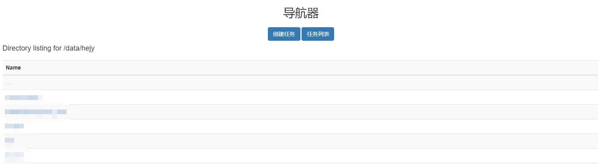

# image-viewer

`image-viewer` is an awesome tool for algorithm engineer to check and share data remotely.


# Install

```
pip install git+https://github.com/eynaij/image-viewer.git 
pip install -r requirements.txt
```
Take a check if installed successfully.

```
image-viewer --version
```

# Configure

```
image-viewer-cfg
```
It will generate a default yaml in `~/.image-viewer/image-viewer.yaml`

You need to edit `port` , `permiitted_dirs` and `default_dir`.

If you don't have `port`, you may refer to your leader for applying port on developing machines.

`permiitted_dirs` is where you allow image-viewer to access data.

`default_dir` should be one of `permiitted_dirs`

# Run

```
image-viewer
```

If no error occurs, open chrome and go to your server address, such as my address `10.16.32.115:8888/`

You might find something like this.



Go to the directory containing images -> Clik '创建任务'
Enjoy to use it.

# ChangeLog

- v1.0.0: created by jianye.he in 2020.12.4
